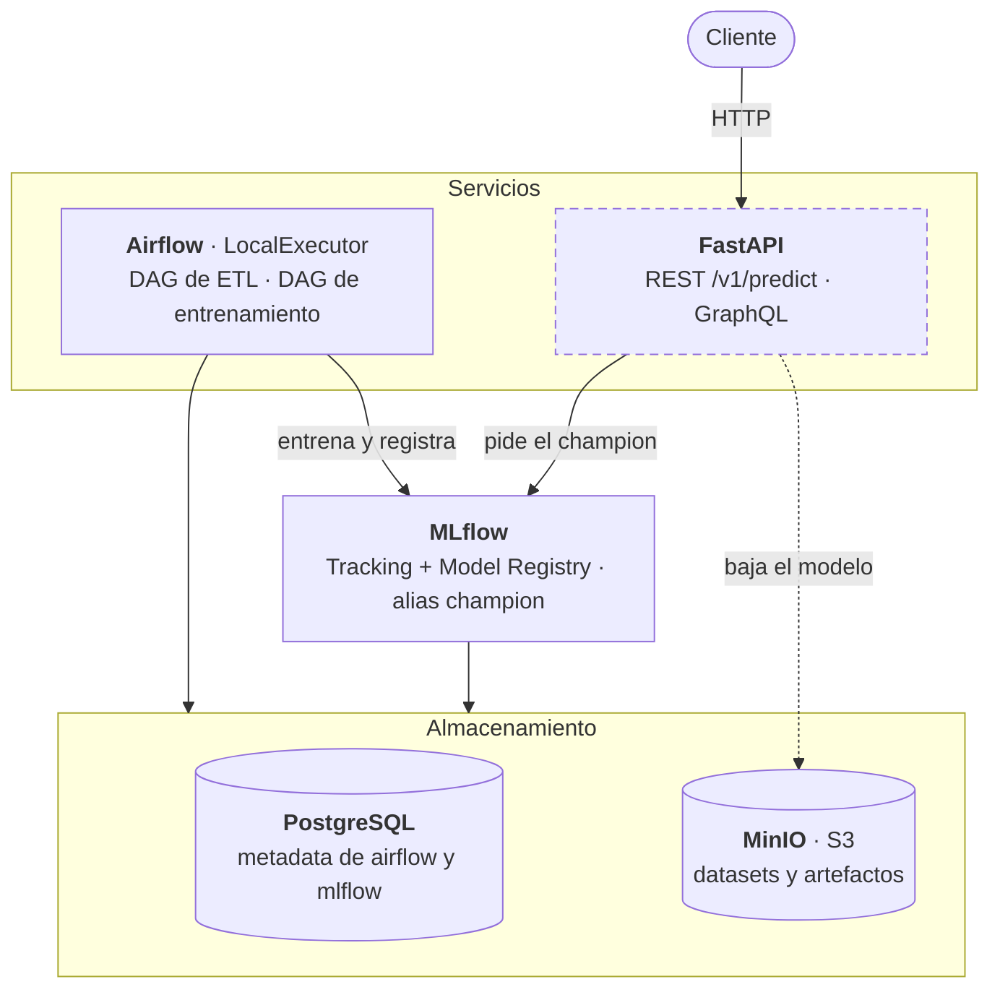

# Trabajo integrador

Plataforma de predicción en tiempo real sobre el modelo de accidente cerebrovascular
desarrollado en Aprendizaje de Máquina I (XGBoost sobre el
[Stroke Prediction Dataset](https://www.kaggle.com/datasets/fedesoriano/stroke-prediction-dataset)).

Nivel contenedores: todo corre sobre Docker.

## Arquitectura



Se lee de arriba hacia abajo: quien hace el trabajo arriba, quién sabe dónde está
cada modelo en el medio, y dónde queda guardado abajo. La división que ordena todo
el diseño es esa última capa: **PostgreSQL guarda metadata, MinIO guarda archivos.**

FastAPI tiene el borde punteado porque todavía no está implementada. Y su flecha
punteada hacia MinIO es la parte que sorprende: MLflow no le entrega el modelo, le
entrega su dirección en S3, y la API lo baja de MinIO por su cuenta — por eso
necesita credenciales de los dos.

## Estado

| Servicio | Rol | Estado |
| --- | --- | --- |
| PostgreSQL | metadata de MLflow y de Airflow, en dos bases separadas | ✅ |
| MinIO | Data Lake S3: datos y artefactos | ✅ |
| MLflow | tracking de experimentos y registro de modelos | ✅ |
| Airflow | orquestación (levantado, todavía sin DAGs) | ✅ |
| FastAPI | serving del modelo (REST + GraphQL) | pendiente |

El modelo del mini-TP 1 ya está registrado en MLflow como `predictor_acv`
versión 1, con alias `champion`, mediante
[`scripts/registrar_modelo_inicial.py`](scripts/registrar_modelo_inicial.py).
Es provisorio: cuando exista el DAG de entrenamiento, el modelo va a entrar
entrenándose dentro de la plataforma y ese script se borra.

## Cómo levantarlo

Parado en `integrador/`:

```bash
docker compose up -d --build
docker compose ps
```

Las credenciales salen de `.env`. Está commiteado a propósito: son credenciales de
desarrollo local, no tienen valor fuera de esta máquina, y así el stack levanta sin
pasos previos.

| Consola | URL | Usuario |
| --- | --- | --- |
| MLflow | http://localhost:5000 | — |
| MinIO | http://localhost:9001 | `mlops` / `mlops12345` |
| PostgreSQL | `localhost:5433` | `mlops` / `mlops` |

Los puertos de arriba son para entrar desde la máquina. Entre contenedores, los
servicios se encuentran por el nombre y el puerto interno: `postgres:5432`,
`minio:9000`, `mlflow:5000`.

Para apagar todo: `docker compose down`. Agregando `-v` se borran además los
volúmenes, con lo que se pierden las bases y los buckets (y `init.sql` vuelve a
ejecutarse en el próximo arranque).

## Verificar que quedó bien

Las dos bases de Postgres:

```bash
docker compose exec postgres psql -U mlops -d airflow -c "\l"
```

Los buckets de MinIO, en http://localhost:9001: tienen que estar `data` y `mlflow`.

El cableado completo de MLflow (metadata a Postgres, artefactos a MinIO):

```bash
docker compose exec mlflow python -c "
import mlflow
mlflow.set_tracking_uri('http://localhost:5000')
mlflow.set_experiment('smoke_test')
with mlflow.start_run() as r:
    mlflow.log_metric('metrica', 0.42)
    print(r.info.artifact_uri)
"
```

Tiene que imprimir una URI `s3://mlflow/...` y la corrida tiene que aparecer en
http://localhost:5000.

## Estructura

```
integrador/
├── docker-compose.yaml
├── .env
└── dockerfiles/
    ├── postgres/init.sql     # crea la base mlflow (la base airflow la crea la imagen)
    └── mlflow/               # imagen propia: mlflow + driver de Postgres + cliente S3
```
