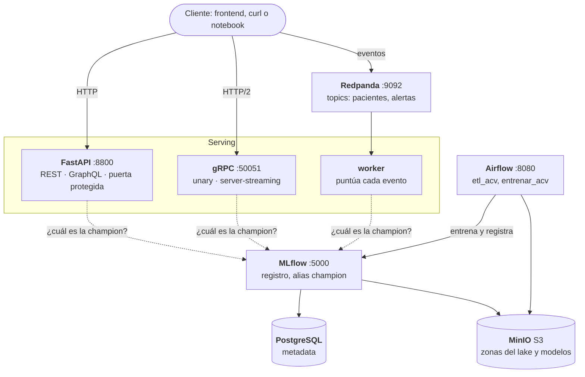

# Trabajo integrador — Plataforma de predicción de ACV

Plataforma de predicción en tiempo real sobre el modelo de **accidente cerebrovascular**
desarrollado en Aprendizaje de Máquina I. El modelo se entrena y se versiona dentro de la
plataforma, y se sirve por **cuatro protocolos** —REST, GraphQL, gRPC y streaming— más una
**puerta protegida** con autenticación, límite de consultas y auditoría.

Nivel de la entrega: **contenedores**. Todo corre sobre Docker, levanta con un solo comando y
no necesita nada instalado en la máquina más que Docker.

## Autor

Antonella Gambarte

## Dataset y modelo

**[Stroke Prediction Dataset](https://www.kaggle.com/datasets/fedesoriano/stroke-prediction-dataset)**
(Kaggle). Diez variables clínicas y demográficas por paciente —edad, hipertensión, cardiopatía,
glucosa promedio, índice de masa corporal, tabaquismo, entre otras— y una etiqueta binaria
`stroke`. El CSV crudo está versionado en `dataset/`.

El modelo es un **XGBoost** entrenado en Aprendizaje de Máquina I. Dos decisiones que vienen de
ahí y la plataforma respeta:

- El **umbral de decisión es 0.4**, no 0.5: el dataset está muy desbalanceado y mover el umbral
  mejora el recall, que es lo que importa en un tamizaje clínico.
- El **BMI faltante se imputa por grupo etario** (0-25, 25-40, 40-60, 60+), con las medianas
  calculadas en el entrenamiento. Si una petición no manda `bmi`, la plataforma lo imputa igual.

La métrica con la que se decide si un modelo nuevo reemplaza al que está en producción es el
**F1**.

## Servicios

El `docker compose up -d` levanta **13 contenedores** (14 contando el productor de
streaming, que va en un perfil aparte). La tabla los agrupa por función: los cuatro servicios de
Airflow aparecen en una sola fila. Las credenciales salen de `.env`, que está commiteado a propósito: son
credenciales de desarrollo local, no tienen valor fuera de esta máquina, y así el stack levanta
sin pasos previos.

| Servicio | Para qué | Dónde | Usuario |
| --- | --- | --- | --- |
| **frontend** | cliente de prueba de los protocolos | http://localhost:3000 | — |
| **fastapi** | REST, GraphQL y la puerta protegida | http://localhost:8800 · [/docs](http://localhost:8800/docs) | — |
| **grpc** | servidor de inferencia gRPC | `localhost:50051` | — |
| **airflow** | orquestación: ETL y entrenamiento | http://localhost:8080 | `airflow` / `airflow` |
| **mlflow** | tracking y registro de modelos | http://localhost:5000 | — |
| **minio** | Data Lake S3 | http://localhost:9001 | `mlops` / `mlops12345` |
| **redpanda** | broker de streaming (API de Kafka) | `localhost:9092` | — |
| **postgres** | metadata de Airflow y de MLflow | `localhost:5433` | `mlops` / `mlops` |
| **streaming-worker** | puntúa los eventos y vigila el drift | sin puerto | — |
| `minio-init`, `airflow-init` | crean buckets y migran la base, y se apagan | — | — |
| `streaming-productor` | genera eventos de prueba (perfil `demo`) | — | — |

Entre contenedores los servicios se encuentran por nombre: `postgres:5432`, `minio:9000`,
`mlflow:5000`, `fastapi:8800`, `grpc:50051`, `redpanda:9092`.

## Flujo de trabajo principal


```mermaid
flowchart TB
    cliente(["Cliente: frontend, curl o notebook"])

    subgraph serving["Serving"]
        fastapi["<b>FastAPI</b> :8800<br/>REST · GraphQL · puerta protegida"]
        grpc["<b>gRPC</b> :50051<br/>unary · server-streaming"]
        worker["<b>worker</b><br/>puntúa cada evento"]
    end

    redpanda["<b>Redpanda</b> :9092<br/>topics: pacientes, alertas"]
    mlflow["<b>MLflow</b> :5000<br/>registro, alias champion"]
    airflow["<b>Airflow</b> :8080<br/>etl_acv, entrenar_acv"]
    minio[("<b>MinIO</b> S3<br/>zonas del lake y modelos")]
    postgres[("<b>PostgreSQL</b><br/>metadata")]

    cliente -->|HTTP| fastapi
    cliente -->|HTTP/2| grpc
    cliente -->|eventos| redpanda
    redpanda --> worker

    airflow -->|entrena y registra| mlflow
    airflow --> minio
    mlflow --> postgres
    mlflow --> minio

    fastapi -.->|¿cuál es la champion?| mlflow
    grpc -.->|¿cuál es la champion?| mlflow
    worker -.->|¿cuál es la champion?| mlflow
```

1. **`etl_acv`** sube el CSV crudo a la zona `raw/` del lake, saca duplicados, pasa las
   categóricas a one-hot, separa train y test, imputa nulos y escala. Deja el dato listo en
   `curated/` y escribe `data_info/data.json` con todo lo que hace falta para preprocesar una
   petición igual que en el entrenamiento.
2. **`entrenar_acv`** entrena un modelo, lo registra en MLflow como una versión nueva y le pone
   el alias `challenger`. Si su F1 supera al del `champion`, **lo promueve**. Además publica el
   artefacto en `models/v<N>/predictor_acv.pkl`.
3. Los **tres procesos de serving** le preguntan a MLflow qué versión tiene el alias `champion`.
   Si cambió, se recargan solos en menos de 30 segundos, **sin reiniciar nada y sin esperar una
   petición**.
4. Un cliente pide una predicción por **REST**, **GraphQL** o **gRPC**: los tres devuelven el
   mismo número.
5. El **productor** publica pacientes al topic `pacientes` y el **worker** los puntúa de a uno,
   calcula métricas por ventana de un segundo, detecta *drift* y avisa por el topic `alertas`.
6. La **puerta protegida** (`/v1/secure/predict`) sirve el mismo modelo pero exige un token con
   rol, limita las consultas por minuto y deja registro de cada predicción.

## Ejecución con Docker Compose

Hace falta **Docker Desktop** y nada más. Parado en `integrador/`:

```bash
docker compose up -d --build
docker compose ps
```

La primera vez tarda unos minutos porque construye cinco imágenes. Cuando todos los servicios
estén `healthy`, **la primera vez hay que generar el modelo**:

1. Entrar a Airflow en http://localhost:8080 con `airflow` / `airflow`.
2. Ejecutar el DAG **`etl_acv`** y esperar que termine.
3. Ejecutar el DAG **`entrenar_acv`**.

Eso deja una versión registrada en MLflow con el alias `champion`, y los tres servicios de
serving la toman solos. Desde ese momento `http://localhost:3000` y
`http://localhost:8800/docs` quedan operativos.

Para la demo de streaming, el productor va en un perfil aparte para que no dispare eventos en
cada arranque:

```bash
docker compose --profile demo up streaming-productor
```

Para apagar todo:

```bash
docker compose down        # conserva las bases y los buckets
docker compose down -v     # borra los volúmenes: hay que volver a correr los dos DAGs
```

## Verificación

Que estén todos arriba:

```bash
docker compose ps
```

Que el modelo esté cargado y con qué versión:

```bash
curl -s localhost:8800/health
# {"status":"healthy","modelo_cargado":true,"version_modelo":"10","umbral":0.4}
```

Que PostgreSQL tenga **las dos bases separadas**, `airflow` y `mlflow`:

```bash
docker compose exec postgres psql -U mlops -d airflow -c "\l"
```

Que el Data Lake tenga las **cuatro zonas** y el modelo versionado:

```bash
docker compose exec fastapi python -c "
import boto3, collections
s3 = boto3.client('s3')
zonas = collections.Counter()
for o in s3.list_objects_v2(Bucket='data').get('Contents', []):
    zonas['/'.join(o['Key'].split('/')[:2])] += 1
for z, n in sorted(zonas.items()): print(f'{z:30} {n}')
"
# curated/acv          4
# data_info/data.json  1
# models/v10           1
# raw/acv              1
# raw/eventos          8
# staged/acv           1
```

Los mismos buckets se pueden mirar en la consola de MinIO: http://localhost:9001

## Probar los cuatro protocolos

La forma más cómoda es **http://localhost:3000**, que tiene una sección por protocolo. Para
hacerlo a mano, el mismo paciente por todas las puertas:

```bash
PACIENTE='{"gender":"Female","age":67,"hypertension":0,"heart_disease":1,
"ever_married":"Yes","work_type":"Private","Residence_type":"Urban",
"avg_glucose_level":228.69,"bmi":36.6,"smoking_status":"formerly smoked"}'
```

### REST

```bash
curl -s -X POST localhost:8800/v1/predict \
  -H "Content-Type: application/json" -d "$PACIENTE"
# {"prediccion":1,"probabilidad":0.5005481839179993,"version_modelo":"10",
#  "descripcion":"Tiene riesgo de ACV"}
```

Un paciente inválido se rechaza con **422** y el detalle campo por campo, antes de tocar el
modelo:

```bash
curl -s -X POST localhost:8800/v1/predict \
  -H "Content-Type: application/json" \
  -d '{"gender":"Female","age":150,"work_type":"Astronauta"}'
```

### GraphQL

En `http://localhost:8800/graphql` está GraphiQL para probar a mano. La **Query** devuelve
metadata del modelo, y el campo `metrics` tiene *resolver* propio: si no se pide, no se consulta
MLflow.

```graphql
{ model { name version metrics { auc f1 recall } } }
```

La **mutation** predice, validando con el mismo contrato de Pydantic que usa REST:

```graphql
mutation {
  predecir(paciente: {
    gender: "Female", age: 67, hypertension: 0, heartDisease: 1,
    everMarried: "Yes", workType: "Private", residenceType: "Urban",
    avgGlucoseLevel: 228.69, bmi: 36.6, smokingStatus: "formerly smoked"
  }) { prediccion probabilidad versionModelo descripcion }
}
```

Los nombres van en camelCase porque así los expone Strawberry.

### gRPC

El `.proto` define dos métodos: `Predecir` (unary) y `PredecirLote`
(**server-streaming**, las respuestas salen de a una mientras el servidor calcula). El cliente
de prueba ejercita los dos y mide latencia contra REST:

```bash
docker compose exec grpc python cliente.py
# --- unary: Predecir (grpc:50051) ---
#   prediccion 1 | probabilidad 0.5005481839179993 | modelo v10 | Tiene riesgo de ACV
# --- server-streaming: PredecirLote (3 casos) ---
# --- latencia, n=100 ---
#   gRPC   media  18.72 ms | p50  18.23 | p95  22.25
#   REST   media  23.86 ms | p50  23.68 | p95  28.75
#   REST/gRPC: 1.27x
```

Las categóricas están **tipadas con `enum`** en el `.proto`, así que un valor inventado no se
puede ni enviar: el contrato lo impide en el cliente.

### Streaming

```bash
docker compose --profile demo up streaming-productor   # en una terminal
docker compose logs -f streaming-worker                # en otra
```

El productor publica 800 pacientes al topic `pacientes` e **inyecta +50 de glucosa a mitad de
camino**. En los logs del worker se ve la media de la ventana saltar de ~107 a ~152 y salir la
alerta por el topic `alertas`. Los eventos aterrizan en el lake particionados por fecha, en
`raw/eventos/fecha=<hoy>/`.

### La puerta protegida

```bash
TOKEN=$(curl -s -X POST localhost:8800/v1/secure/token \
  -H "X-API-Key: clave-de-servicio-local" -H "Content-Type: application/json" \
  -d '{"usuario":"antonella","rol":"analista"}' | grep -o '"token":"[^"]*' | cut -d'"' -f4)

curl -s -X POST localhost:8800/v1/secure/predict \
  -H "Authorization: Bearer $TOKEN" \
  -H "Content-Type: application/json" -d "$PACIENTE"
```

Sin token devuelve **401**; con un rol que no esté habilitado, **403**; pasando las 5 consultas
por minuto, **429**. Cada predicción que pasa queda registrada, y la auditoría la lee solo el
rol `admin`:

```bash
curl -s localhost:8800/v1/secure/auditoria -H "Authorization: Bearer $TOKEN_ADMIN"
# [{"ts":"2026-10-15T18:42:07+00:00","usuario":"antonella",
#   "hash_entrada":"c96a59f2814f…","prediccion":1,"version_modelo":"10"}]
```

## Estructura del repositorio

```
integrador/
├── docker-compose.yaml        los servicios, la red y los volúmenes
├── .env                       credenciales y puertos de desarrollo
├── dataset/                   el CSV crudo, versionado
├── airflow/dags/
│   ├── etl_acv.py             6 tareas: del CSV crudo a curated/
│   ├── entrenar_acv.py        entrena, registra y promueve
│   └── utils/                 rutas del lake y parámetros compartidos
├── api/
│   ├── main.py                REST y el montaje de GraphQL
│   ├── modelo.py              carga del champion y recarga en caliente
│   ├── esquema_graphql.py     Query de metadata y mutation predecir
│   ├── seguridad.py           la puerta protegida
│   ├── contrato.py            el Pydantic que comparten REST y GraphQL
│   └── src/predict.py         preprocesa con data.json y puntúa
├── grpc_service/
│   ├── scoring.proto          el contrato: enums, unary y server-streaming
│   ├── server.py              baja el modelo del lake y sirve
│   ├── cliente.py             cliente de prueba y medición de latencia
│   └── mapas.py               traducción enum ↔ texto del entrenamiento
├── streaming/
│   ├── productor.py           publica pacientes e inyecta drift
│   └── worker.py              puntúa, mide por ventana y alerta
├── frontend/                  cliente de prueba (Nuxt)
├── dockerfiles/               una imagen por servicio
├── notebooks/
│   └── comparaciones.ipynb    las mediciones entre protocolos
└── docs/
    └── arquitectura.html      documentación detallada de cada decisión
```

## Carpetas y archivos clave

| Ruta | Qué hace |
| --- | --- |
| `docker-compose.yaml` | define los servicios, la red y los volúmenes. El anchor `x-airflow-common` evita repetir la configuración en los cuatro servicios de Airflow |
| `airflow/dags/etl_acv.py` | las 6 tareas del ETL. Escribe `data_info/data.json`, que es lo que permite que la inferencia preprocese **exactamente** igual que el entrenamiento |
| `airflow/dags/entrenar_acv.py` | entrena, registra y decide la promoción con `f1_challenger > f1_champion` |
| `api/modelo.py` | el estado del modelo en una tupla, y el hilo que cada 30 s pregunta si hay un champion nuevo |
| `api/contrato.py` | un solo contrato de entrada para REST, GraphQL y la puerta protegida: los tres rechazan exactamente la misma entrada |
| `api/src/predict.py` | aplica `data.json` —one-hot, imputación por grupo etario y escalado— y puntúa con el umbral 0.4 |
| `grpc_service/scoring.proto` | el contrato tipado. Las categóricas son `enum`, el `bmi` es `optional` para distinguir "no vino" de "vino en cero" |
| `streaming/worker.py` | ventana deslizante de un segundo, throughput y p95, detección de drift y aterrizaje en el lake |
| `dockerfiles/postgres/init.sql` | crea la base `mlflow`; la base `airflow` la crea la imagen |
| `docs/arquitectura.html` | el detalle de cada decisión, con el paso a paso y las alternativas descartadas |

## Conceptos generales importantes

**PostgreSQL guarda metadata, MinIO guarda archivos.** Es la división que ordena todo el diseño.
MLflow no entrega el modelo: entrega su dirección en S3, y el servicio lo baja por su cuenta —
por eso necesita credenciales de los dos.

**Champion y challenger.** Cada corrida de `entrenar_acv` registra una versión nueva y la marca
`challenger`. La promoción a `champion` es automática y por F1, con comparación estricta: si
empata, no promueve.

**Las cuatro zonas del Data Lake.** El bucket `data` está organizado como se enseña en la
materia: `raw/` el dato crudo e inmutable en CSV, `staged/` limpio y en Parquet, `curated/` las
features listas para entrenar, y `models/v<N>/` el artefacto publicado y versionado. El número
de carpeta es la versión de MLflow, así los dos quedan atados.

**Recarga en caliente.** Los tres procesos de serving tienen un hilo que cada 30 segundos le
pregunta a MLflow qué versión es la champion. Si cambió, la bajan y la reemplazan de una sola
asignación. El modelo se actualiza **sin reiniciar el contenedor y sin que llegue tráfico**.

**El modelo vive en dos lugares, a propósito.** FastAPI lo carga con el cargador de MLflow
(`mlflow.sklearn.load_model`); el servidor gRPC y el worker bajan el `.pkl` versionado del lake
con `boto3` y `joblib`. Los tres le preguntan a MLflow qué versión corresponde, y los tres
devuelven el mismo número — está verificado. Son las dos formas que enseña la materia y
conviven sin conflicto.

**El preprocesamiento está escrito una vez y se aplica dos veces.** El ETL calcula las medianas
y los parámetros de escalado y los deja en `data_info/data.json`; la inferencia los lee de ahí.
Si se recalcularan en la inferencia, el modelo recibiría datos escalados de otra forma que en el
entrenamiento, y las predicciones serían silenciosamente incorrectas.

**Seguridad.** La puerta protegida no reemplaza a `/v1/predict`: es un endpoint aparte. Dos
límites conocidos de la implementación, que son los del material de la materia: el contador del
límite por minuto vive **en memoria** —alcanza porque uvicorn corre con un solo worker, en
producción iría en Redis o en el gateway— y la auditoría también, así que se pierde al reiniciar
el contenedor.

---

Para el detalle de cada decisión, las alternativas que se descartaron y las mediciones completas:
**[`docs/arquitectura.html`](docs/arquitectura.html)**.
